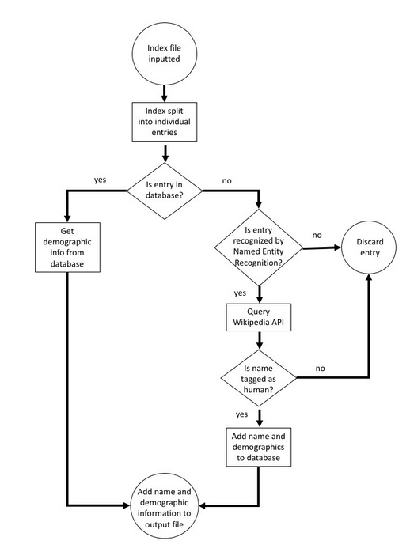

---
title: How the Code Works
layout: default
filename: codemethod.md
--- 
# How the Code Works

ADAPT is capable of either analyzing an entire textbook or an index. For the majority of the paper, we analyze indices as their shorter length enables us to get scans of them while still remaining within fair use.

The tool consists of two primary phases. The first portion involves matching out the names found within the textbook and the second phase involves querying their demographic information. The below flowchart displays the basic routine run by ADAPT.

<figure>
  
  <figcaption>A simplified illustration of how ADAPT examines a textbook index to identify names, before updating the database with identified names and demographics and then outputting a file with a list of scientists mentioned in the index together with their demographics.  The input file can either be a source PDF of a textbook index or a PDF of a scanned-in hard copy index that has been subjected to optical character recognition.  The methods used to obtain demographic information are detailed in the text.</figcaption>
</figure>

## Grabbing out a Name

### Basic Methodology
 
(*If processing an index*) Indices typically contain one entry per new line, so if we separate our read in text by newline, we can reliably separate our input index into separate entries. We word tokenize these entries. All tokens are then tagged with named-entity recognition tags (such as 'PERSON', 'ORGANIZATION', 'LOCATION', etc.). Upon completing named entity recognition tagging of text, we then iterate through the word tokens and remove all non-upper case tokens (as names are upper-cased) and a list of common stopwords. Note that we complete all named-entity recognition prior to cleaning in order to preserve context, as the machine learning algorithm relies on information from surrounding words and sentence structures to perform classification.

Since each entry index will typically only contain one name, we check each word token and build a full name out of the words. Names can be matched in two ways: if a token is tagged as a 'PERSON' by named entity recognition, or if a token matches a name found in the physicist database. You can find information on how the database is constructed in the Database page of the website. We find all names found in the index entry and append them together to form our name string. Let us take a look at the example ['Erwin', 'Schrodinger']. We will match 'Erwin' and add it to FullName. Then we will match 'Schrodinger', and add it to the end of FullName. Now that the array is exhausted, we output 'Erwin Schrodinger' as the full name. This is the basic matching idea.

(*If processing a full book*) If an entire book is being processed, we follow the same process with some slight deviations. Unlike an index, there are no discrete entries that only contain a single idea. Everything is at the sentence level and there is higher complexity. We first sentence tokenize the input text into individual arrays and then split the sentence arrays with "ands" or commas into finer arrays. This way, we can once again ensure that each array should only contain a single name. After performing these processing steps, we follow the same procedure as for the index to check if an array contains a person and build out their full name.
 
To reduce computation time, everytime we successfully match a token to the name in the database we also save the position we found the token in the database so that we can later directly grab the demographic information when we need it at constant time. Thus, the full output of the name grabbing phase is the full name as well as its corresponding database index position. If the entry is not in the database, but it is tagged as 'PERSON' by the NER, we only return the queried entry with the corresponding index location info empty.

### Heuristics

There are multiple cases that can help simplify our job and increase accuracy. We will cover a few of the cases.
 
#### Case 1: An initial is present
 
If the index entry contains an initial (an uppercase letter followed by a period, ex: the “G.” in “G. Zweig”). We then check if there is a name present in the array. If there is an initial and a name, we know that the tokens in the array comprise a full name (This is a pattern we have found in all analyzed indices thus far). The full array is added to FullName and outputted.
 
#### Case 2: A dash is present
 
We then check if the entry contains a dash (ex: Biot-Savart). If it does, we assume each side of the dash contains a full name and analyze each part individually. If both sides are names, we give two outputs (ex: Biot-Savart will output both Biot and Savart).
 
At times, this dash splitting method can be problematic if an individual’s full last name consists of a dash (ex: Claude Cohen-Tannoudji will be analyzed as one individual named Cohen and another named Tannoudji). However, we still utilize this method as there is no way to discern between two names and a single name, and splitting of dashes achieves the highest accuracy.

### Side Notes

Sometimes, only last names are found within an entry. This can lead to confusion with names (Ex: “Taylor” can query both “Edwin Taylor” and “Brook Taylor” from the DB). This will be handled in the later phase.
 
## Querying the Demographic Information
 
In this phase, we look through the names that are returned from the first phase of name grabbing. If the entry has a corresponding location in the database, we first check if the database entry correctly corresponds to the tagged entry by checking if the first name and last name of the individual matches our database entry. If only a last name exists, we only check the last names against one another. If it does, we add a dictionary containing all of the info corresponding to the name from the database to a list. If the entries first and last name does not match (meaning we have matched a name through our database but the individuals are not exactly the same) or was tagged by NER, we query Wikipedia through the Wikimedia API and return a dictionary containing the same headings as our database that is also added to the list. This dictionary entry is then added to our database so that it can be matched for any future processing. This is what makes the tool adaptive. The more indices and textbooks that are analyzed, the more new names that will be found by NER and added to the database. After all entries have been processed, we write the list of dictionaries to a csv. This is the final output of the tool.

## Examples

### Index

'Helmholtz free energy' -> (word tokenize) ['Helmholtz', 'free', 'energy'] -> (Perform NER) -> (remove non-upper case) ['Helmholtz'] -> (database match, return database dictionary) -> {'Name': 'Helmholtz', 'Wiki Name':	'Hermann_von_Helmholtz', 'Human':	'human (Q5)', 'Sex':	'male (Q6581097)', 'Birth Location':	'Potsdam (Q1711)', 'Birth Country':	 Germany, 'Race':	'white', 'MatchName':	'HELMHOLTZ', 'FullName':	'Hermann Helmholtz', 'Wiki Race': '', 'Matching Names':	TRUE] -> (write this entry to output csv)

### Textbook

'Helmholtz free energy is a very useful thermodynamic potential. It can have multiple uses.' -> (sentence tokenize) ['Helmholtz free energy is a very useful thermodynamic potential', 'It can have multiple uses'] -> (focus in on first element, word tokenize) ['Helmholtz', 'free', 'energy', 'is', 'a', 'very', 'useful', 'thermodynamic', 'potential'] -> (perform NER) -> (remove non-upper case) ['Helmholtz'] -> (database match, return database dictionary) -> {'Name': 'Helmholtz', 'Wiki Name':	'Hermann_von_Helmholtz', 'Human':	'human (Q5)', 'Sex':	'male (Q6581097)', 'Birth Location':	'Potsdam (Q1711)', 'Birth Country':	 Germany, 'Race':	'white', 'MatchName':	'HELMHOLTZ', 'FullName':	'Hermann Helmholtz', 'Wiki Race': '', 'Matching Names':	TRUE] -> (write this entry to output csv)

## Sanitization

We check the "Matching Names" bool following the output of the csv. The “Matching Names” bool is True if the tagged entry matches the output entry, and False if otherwise. If True, the entry is left alone, but if marked as False, this indicates that the tagged entry differs from the queried entry. Usually, this results from OCR error, initial abbreviation mismatches (G. Zweig vs. George Zweig), full name mismatches (Edwin Taylor vs. Edwin F. Taylor) or accent mark mismatches (Rontgen vs. Roentgen). If that is the case, the entry is left alone. However, oftentimes if there is only a single name that is tagged, the incorrect entry may be queried (the tool may tag “Taylor” out of “Taylor Series” which should be attributed to “Brook Taylor”, however the automated querying may return “Edwin F. Taylor” instead) and this error must be manually corrected by requerying with the full name instead of only the partial.